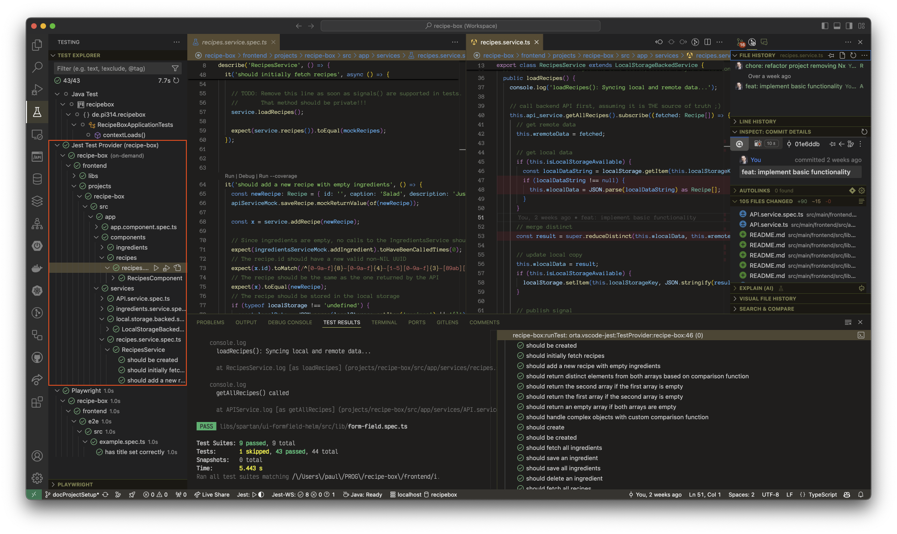
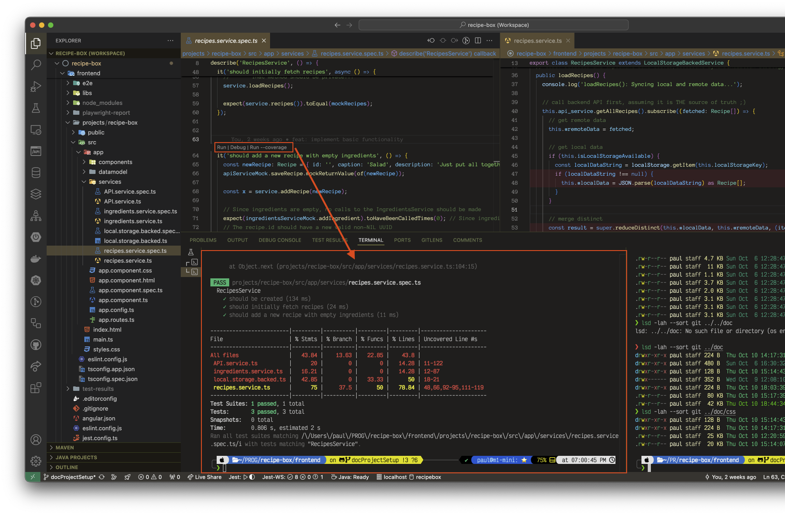
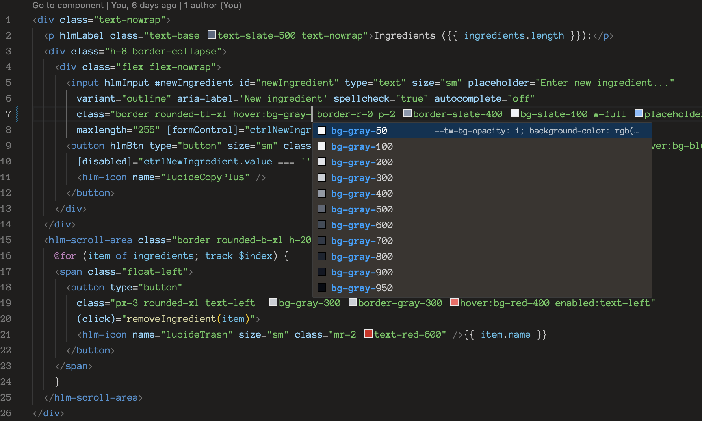
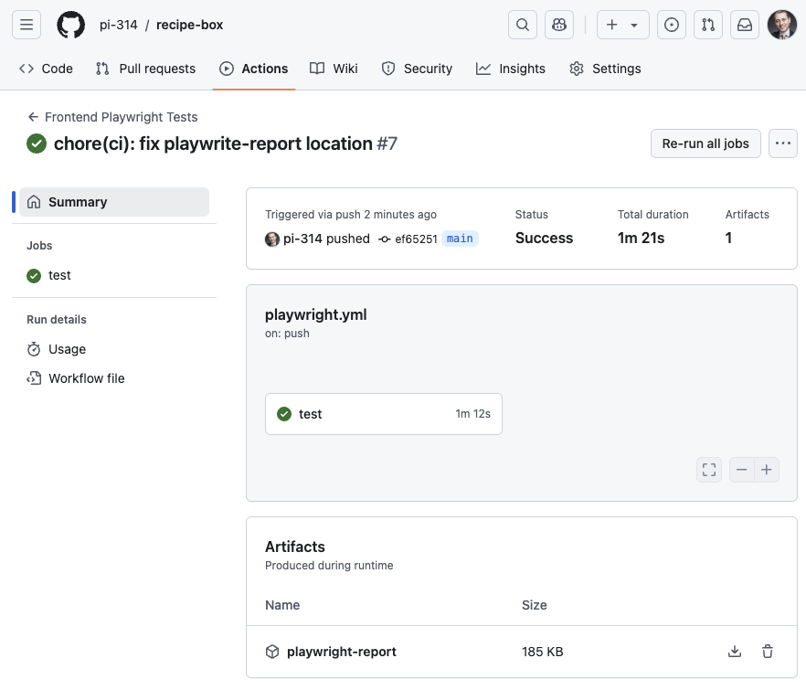
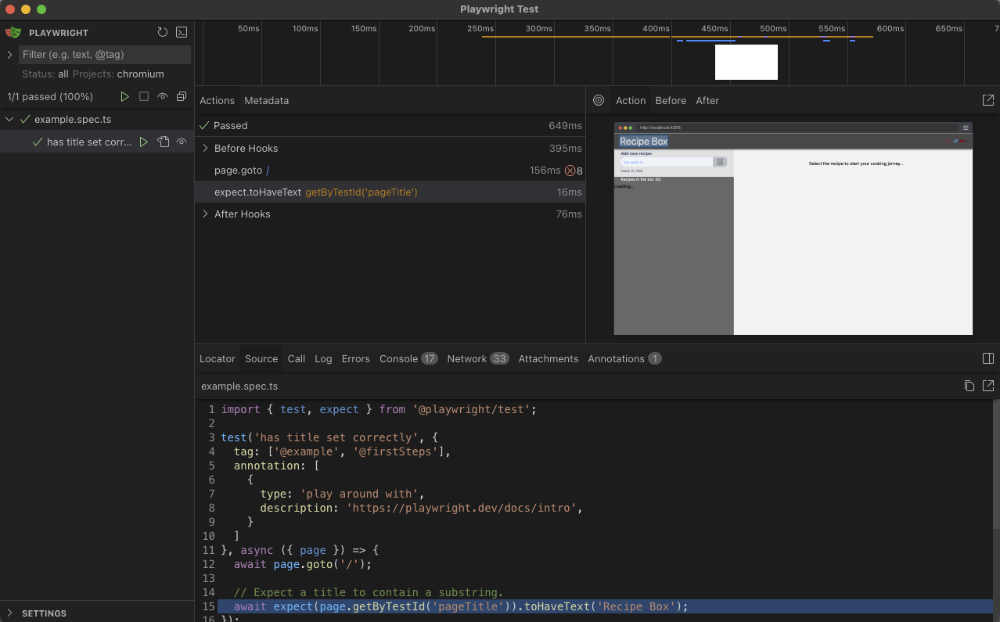
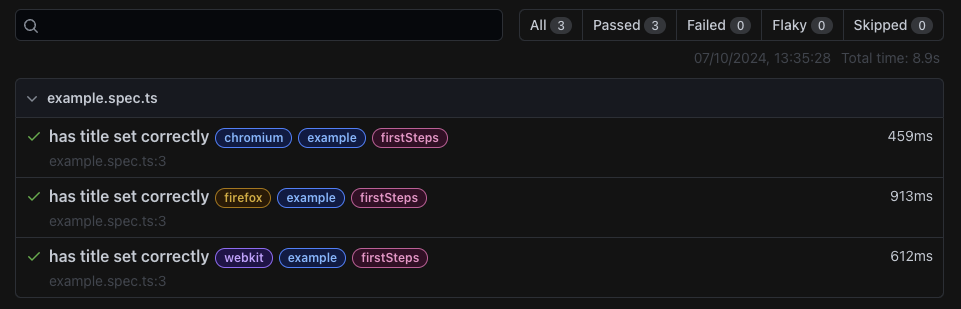
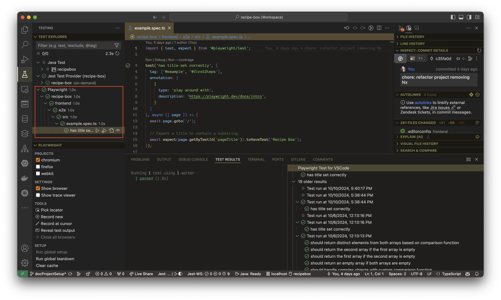

= Angular18 Project Setup
:author: Pi-314
:title: Setup Angular18 Project using Jest+Playwright+TailwindCSS+Spartan/ui
:description: Detailed step-by-step guide on how to set up a project using the latest versions of Angular, Jest, Playwright, Tailwind CSS, and Spartan/ui.
:highlightjsdir: highlight
:source-highlighter: highlightjs
:highlightjs-theme: atom-one-light
:toc: left
:toclevels: 2
:stylesdir: css
:stylesheet: asciidoctor-next.min.css

[.small]#_Detailed step-by-step guide on how to set up a project using the latest versions of Angular, Jest, Playwright, Tailwind CSS, and Spartan/ui._#

****
[.small]#Many guides are available for setting up an Angular project with a similar set of frameworks and tools. However, as of October 2024, many of them describe outdated versions and follow the conventions, that are deprecated or even changed in the latest versions of the tools, which can be quite confusing for developers who are not familiar with the historical evolution of these conventions.#
****

The intention of this document is to provide a step-by-step guide on how to set up a project using the latest versions of these frameworks and tools, ensuring that you are following modern best practices and conventions.

*What we're going to do*:

After having set up our basic Maven-based Java project, we will now add an Angular frontend to it, following the https://en.wikipedia.org/wiki/Monorepo[monorepo, role=underline,window=_blank] approach. This means that the Angular project will be placed in a separate folder at the top-level of our repository, while the Java project will remain in its original location, so our top-level repository structure will look as follows:

[source, console]
----
<Java-project-root>
├── <AngularFrontend> <--- new top-level folder
├── .gitignore
├── .env
├── src
├── README.md
└── pom.xml
----

  - As soon as possible, we will use the ES module format for the configuration files, which is the recommended way for modern JavaScript projects, writing them preferably in TypeScript (`.ts`). However, some tools and libraries may not yet fully support this format, so we will use the CommonJS format where necessary, keeping in mind that this is a temporary solution.

  - We will install all suitable modern linting and testing tools, and configure them to work seamlessly together and with an IDE (using the example of VS Code), ensuring that our project is prepared for being well-tested and follows the best practices for code quality.

  - We will use following tools and frameworks versions:

[%header%autowidth, grid=rows, cols="a,m"]
|===
| Tool/Framework | Version
| *Angular* | 18.2.6
| *Jest* | 29.7.0
| *Tailwind CSS* | 3.4.13
| *Spartan/ui* | 0.0.1-alpha.356
| *Playwright* | 1.47.2
| NodeJS | 20.17.0
| npm | 10.8.3
|===

NOTE: The versions of the tools and frameworks mentioned above was the latest at the time of the initial demo project setup and are subject to be updated, as long as the simple update not break the setup. Please reffer to the `package.json` file for the exact versions used in the project and make sure to check the official documentation for the most recent versions.

:sectnums:
== Prerequisites

For setting up an Angular project, you need to have *NodeJS* installed on your machine. Depending on your operating system, you can download the installer from the official NodeJS website: https://nodejs.org/en/download/["NodeJS Download", role=underline,window=_blank] or install it using a package manager in your OS like `brew` on macOS, `choco` on Windows or `apt` on Linux as well as the tools for  managing multiple NodeJS versions on the same machine like Node Version Manager (nvm).

In following steps, we assume that NodeJS is already installed and available in the system path, so you can run the `node` and `npm` commands from the terminal like this:

[source, shell]
----
❯ node --version
v20.17.0
❯ npm --version
10.8.3
----

== Install *Angular CLI*

https://angular.dev/tools/cli["Angular CLI", role=underline,window=_blank] is a command-line interface for creating, building, testing, and deploying Angular applications. It is published on `npm` as the `@angular/cli` package and includes a binary named `ng`.

.Install Angular CLI (globally!) and check the version:
[source, shell]
----
❯ npm install -g @angular/cli \
  && ng version
----

.The output should look like this:
[source, console]
----
     _                      _                 ____ _     ___
    / \   _ __   __ _ _   _| | __ _ _ __     / ___| |   |_ _|
   / △ \ | '_ \ / _` | | | | |/ _` | '__|   | |   | |    | |
  / ___ \| | | | (_| | |_| | | (_| | |      | |___| |___ | |
 /_/   \_\_| |_|\__, |\__,_|_|\__,_|_|       \____|_____|___|
                |___/
    

Angular CLI: 18.2.6
Node: 20.17.0
Package Manager: npm 10.8.3
OS: darwin arm64

Angular: 18.2.6
... animations, cli, common, compiler, compiler-cli, core, forms
... platform-browser, platform-browser-dynamic, router

Package                         Version
---------------------------------------------------------
@angular-devkit/architect       0.1802.6
@angular-devkit/build-angular   18.2.6
@angular-devkit/core            18.2.6
@angular-devkit/schematics      18.2.6
@schematics/angular             18.2.6
rxjs                            7.8.1
typescript                      5.5.4
zone.js                         0.14.10
----

The `ng` command, which we will use in most of the following setup steps, is now available globally on your system.

NOTE: In this case we installed Angular CLI globally. If you for some reason want to have different versions of Angular CLI for different projects, you can also install it locally in your project directory by omitting the `-g` flag. However, it will create a `package.js` along with the `package-lock.js` file and the `node_modules` directory in your project folder. Additionally, you need then make the `ng` command available in your terminal by adding the `node_modules/.bin` directory to your path at least at the session level. Even if theoretically possible, this setup may become quite tricky to manage correctly in the long run, and is extremely error-prone. Therefore, it is recommended to install Angular CLI globally and use the same version for all your projects.

== Create Angular Workspace

Since we are adding the frontend app on top of our Maven-based Java project, we will first create an empty Angular workspace in a separate top-level folder named `frontend`, which will also be the workspace's name.

IMPORTANT: Angular CLI expects, that the directory where you are going to create the Angular project is already under version control (Git). If it is not, you will be prompted to initialize a new Git repository in that directory, which might be not exactly what you want. Therefore, it is recommended to set up the Angular project in a directory that is already under version control.

.From the Java project root directory, create a new empty Angular workspace `frontend`:
[source, shell]
----
❯ ng new frontend --create-application false
----

.This will create a new top-level folder and populate it with the initial Angular configuration:
[source, console]
----
<Java-project-root>
├── frontend	      <—-- new Angular workspace
│   ├── .gitignore
│   ├── .editorconfig
│   ├── README.md
│   ├── angular.json
│   ├── package-lock.json
│   ├── package.json
│   └── tsconfig.json
├── src
├── README.md
└── pom.xml
----

.Now we can cd into it:
[source, shell]
----
❯ cd frontend
----

IMPORTANT: All commands in the following steps should be executed from this directory, which is referred to as `_<NgWsRoot>_`.

== Create Angular app

.Generate our new app `recipe-box` (interactive):
[source, shell]
----
❯ ng generate application recipe-box
----

When prompted, choose:

 - CSS (since we are going to use the Tailwind CSS library) and 
 - no SSR

.The generator will show all changes made to the project:
[source, console]
----
? Which stylesheet format would you like to use? CSS [ https://developer.mozilla.org/docs/Web/CSS ]
? Do you want to enable Server-Side Rendering (SSR) and Static Site Generation (SSG/Prerendering)? no
CREATE projects/recipe-box/src/app/app.component.css (0 bytes)
CREATE projects/recipe-box/src/app/app.component.html (19903 bytes)
CREATE projects/recipe-box/src/app/app.component.spec.ts (928 bytes)
CREATE projects/recipe-box/src/app/app.component.ts (306 bytes)
CREATE projects/recipe-box/src/main.ts (250 bytes)
CREATE projects/recipe-box/src/app/app.config.ts (310 bytes)
CREATE projects/recipe-box/src/app/app.routes.ts (77 bytes)
CREATE projects/recipe-box/tsconfig.app.json (432 bytes)
CREATE projects/recipe-box/tsconfig.spec.json (442 bytes)
CREATE projects/recipe-box/public/favicon.ico (15086 bytes)
CREATE projects/recipe-box/src/index.html (295 bytes)
CREATE projects/recipe-box/src/styles.css (80 bytes)
UPDATE angular.json (2805 bytes)
UPDATE package.json (1035 bytes)
✔ Packages installed successfully.
----

.Angular CLI generated a basic app structure and placed it inside the `projects` subdirectory:
[source, console]
----
<repository-root>
├── frontend     <--- <NgWsRoot>
│   ├── projects        <----- new 'projects' subdirectory 
│   │   └── recipe-box  <----- new 'recipe-box' app
│   │       ├── public
│   │       │   └── favicon.ico
│   │       ├── src
│   │       │   ├── app
│   │       │   │   ├── app.component.css
│   │       │   │   ├── app.component.html
│   │       │   │   ├── app.component.spec.ts
│   │       │   │   ├── app.component.ts
│   │       │   │   ├── app.config.ts
│   │       │   │   └── app.routes.ts
│   │       │   ├── index.html
│   │       │   ├── main.ts
│   │       │   └── styles.css
│   │       ├── eslint.config.js
│   │       ├── tsconfig.app.json
│   │       └── tsconfig.spec.json
│   ├── .gitignore
│   ├── .editorconfig
│   ├── README.md
│   ├── angular.json
│   ├── package-lock.json
│   ├── package.json
│   └── tsconfig.json
├── src
├── README.md
└── pom.xml
----

== Setup *ESLint*

Angular CLI has built-in support for ESLint, so it will be set up automatically when you use `ng lint` for the first time. Later on, we will make a few adjustments to the ESLint configuration to make it work better with our project. 

.Initialize ESLint (interactive, just follow the Angular CLI instructions then test):
[source, shell]
----
❯ ng lint
...
> frontend@0.0.0 lint
> ng lint

Linting "recipe-box"...

All files pass linting.
----

.Install ESLint JS Types (omited by default):
[source, shell]
----
❯ npm i --save-dev @types/eslint__js
----

IMPORTANT: ESLint 9.+ have introduced a new flat configuration format that is not yet fully supported by the Angular CLI `_angular-eslint_` plugin. Although ESLint can now accept `.js`, `.mjs`, `.cjs` files — and also `.ts`, `.mts`, and `.cts` (currently considered unstable, so available only with 'experimental' flag) — the Angular CLI is only compatible with a `.js` file extension, meaning that all generated configurations are still in the CommonJS format in `.js` files. Since the Angular app doesn't have a `"module":` declaration in its `tsconfig.json` file, that files should have actually the `.mjs` or `.cjs` extension, which is unfortunately not supported by the `angular-eslint` plugin at the moment. See https://github.com/angular-eslint/angular-eslint/issues/1859["angular-eslint#1859", role=underline,window=_blank] for more details. +
 +
Therefore, we will continue using the `eslint.config.js` format with CJS syntax for now and transition to `.ts` files once the plugin supports all these formats. Until then, we should ignore the *'File is a CommonJS module; it may be converted to an ES module.ts(80001)'* suggestion thrown by the TS compiler for these files.

=== 🧩 ESLint extension

If your IDE is VS Code and you are using the https://marketplace.visualstudio.com/items?itemName=dbaeumer.vscode-eslint["ESLint extension", role=underline,window=_blank], (which you are then strongly encouraged to do,) you may want to adjust the extension's settings, since it may not recognize by default your `eslint.config.js` file in the `frontend` subdirectory. To fix this, add the following to your `<ProjectRoot>/frontend/.vscode/settings.json` file:

[source, json]
----
{
  "eslint.workingDirectories": [
    "./frontend"
  ]
}
----

This will tell the ESLint extension to look for the ESLint configuration in the `frontend` subdirectory. Further more, you can also adjust a few other settings to make the extension work better with the Angular project:

[source, json]
----
{
  "js/ts.implicitProjectConfig.target": "ES2022",
  /*
    * If ESLint extension is installed, let it use correct 
    * (flat, eslint.config.js -format) settings for eslint v9.+
    */
  // Let ESLint use the same node version as the project (assumes 'node' is in the PATH)
  // Otherwise, it will use the version bundled with the extension
  "eslint.runtime": "node",
  // Use the flat config format (eslint.config.js) instead of the legacy .eslintrc
  "eslint.useFlatConfig": true,
  // Use the new ESLint class-based configuration
  "eslint.useESLintClass": true,
  // Format the code on save
  "editor.formatOnSave": true,
  // Use ESLint as the formatter
  "eslint.format.enable": true,
  // If multiple formatters are installed, ensure ESLint is the default one for JS
  "[javascript]": {
    "editor.defaultFormatter": "dbaeumer.vscode-eslint"
  },
  // Since we're using a monorepo directory layout, we need to tell eslint
  // where to start looking for the config(s):
  "eslint.workingDirectories": [
    {
      "directory": "./frontend",
    }
  ],
}
----

NOTE: We're putting these specific settings in the `.vscode/settings.json` file *in the `frontend` subdirectory*, so they will only apply to this Angular project, while the extension will continue using its 'usual' VS Code workspace settings for other projects.

Now you can enjoy the full power of the ESLint extension in your Angular project. It will show you the linting errors and warnings for all Angular specific artefacts (including HTML-Templates) directly in the editor, so you can fix them on the fly.

== Setup *Jest* instead of Karma

Replacing Karma with Jest in an Angular project can bring several benefits:

  - *Faster test execution*: Jest runs tests in parallel, making it much faster than Karma, which often uses slower browsers for testing.
  -	*Built-in features*: Jest comes with built-in functionalities like mocking, coverage reports, and snapshot testing, reducing the need for additional configurations and dependencies.
  -	*Simpler setup*: Jest is easier to set up and configure compared to Karma, which typically requires more dependencies (like a separate test runner and browser launcher).
  -	*Better developer experience*: Jest offers a more user-friendly interface with features like watch mode and clear test failure messages, improving the overall development and debugging process.

=== Install Jest instead of Karma/Jasmine

First, we uninstall Karma, which is set up by default, and then install Jest along with a few additional dependencies.

.Uninstall Karma:
[source, shell]
----
❯ npm uninstall \
    karma \
    karma-chrome-launcher \
    karma-coverage \
    karma-jasmine \
    karma-jasmine-html-reporter \
    jasmine-core \
    @types/jasmine
----

.Install Jest:
[source, bash]
----
❯ npm install --save-dev \
    jest \
    @types/jest \
    @jest/globals \
    jest-preset-angular \
    ts-node
----

IMPORTANT: `@jest/globals` allows you to use Jest's global functions like `describe`, `it`, `expect`, etc. in your test files without importing them explicitly. It mimics the behavior of Jasmine, which is the default testing framework for Angular projects. You may consider removing it if you prefer to import Jest functions explicitly. +
`ts-node` is required because we are going to use the `.ts` configuration files.

=== Remove Karma test runner from `angular.json` file

.This fragment should be *REMOVED* from the `_<NgWsRoot>_/angular.json`:
[source,json]
----
...
        ,
        "test": {
          "builder": "@angular-devkit/build-angular:karma",
          "options": {
            "polyfills": [
              "zone.js",
              "zone.js/testing"
            ],
            "tsConfig": "projects/recipe-box/tsconfig.spec.json",
            "assets": [
              {
                "glob": "**/*",
                "input": "projects/recipe-box/public"
              }
            ],
            "styles": [
              "projects/recipe-box/src/styles.css"
            ],
            "scripts": []
          }
        }
...
----

NOTE: If migrating an existing project, you should also remove all orphaned Karma-related files at this step, i.e.:
`rm ./karma.conf.js ./src/test.ts`.

=== Add a workspace-level `tsconfig.spec.json` file

.Add `_<NgWsRoot>_/tsconfig.spec.json`:
[source, json]
----
{
    "extends": "./tsconfig.json",
    "compilerOptions": {
      "outDir": "./out-tsc/spec",
      "module": "ES2022",
      "types": ["jest"]
    },
    "include": ["src/**/*.spec.ts", "src/**/*.d.ts"]
}
----

=== Edit the app-level `tsconfig.spec.json` file
 - add "module"
 - in "types[]" change 'jasmine' -> 'jest' 

.Edit `_<NgWsRoot>_/projects/recipe-box/tsconfig.spec.json`:
[source,json]
----
{
  "extends": "../../tsconfig.json",
}
----

=== Add a workspace-level `setup-jest.ts` file

.Add `_<NgWsRoot>_/setup-jest.ts` with the following content:
[source, typescript]
----
import "jest-preset-angular/setup-jest";
----

=== Add a workspace-level `jest.config.ts` file

.Add `_<NgWsRoot>_/jest.config.ts`:
[source,typescript]
----
import type { JestConfigWithTsJest } from 'ts-jest';

export default {

  preset: 'jest-preset-angular',
  setupFilesAfterEnv: ['<rootDir>/setup-jest.ts'],

} satisfies JestConfigWithTsJest;
----

=== (Optional) Add Jest test runner to the `angular.json` file

If you want to run Jest tests using the Angular CLI (like `ng test`), you can add a custom builder to the `angular.json` file. This is not strictly necessary, as you can run Jest tests directly using the Jest CLI (`npx jest`) or using the npm scripts (like `npm test`).

TIP: The following configuration is quite an inelegant solution, as it is a workaround for the current limitations of the Angular CLI. The Angular CLI does not yet support Jest as a test runner out of the box, so we need to use a custom builder, which in turn requires a few additional configuration adjustments to work properly in our setup. This is not the recommended way to run Jest tests in an Angular project, but it still can be done if you want to use the Angular CLI for running tests. The Angular team is working on adding official support for Jest in the Angular CLI, so this workaround may become obsolete in the future.

Assuming you have already installed Jest and other dependencies as described above, you will need to install the `@angular-builders/jest` package.

.Install `@angular-builders/jest` package:
[source, shell]
----
❯ npm install --save-dev @angular-builders/jest
----

The `@angular-builders/jest` runner automatically loads a default configuration, which is not fully compatible with our setup. In particular, it imports the `jest-preset-angular/setup-jest` module, which will conflict with the import in our custom `setup-jest.ts` file. Therefore, we will need to add the `jest.config.ts` file at the app-level to override the `setupFilesAfterEnv` option in the root Jest configuration.

.Add `_<NgWsRoot>_/projects/recipe-box/jest.config.ts`:
[source,typescript]
----
import rootJestConfig from '../../jest.config';

// override the setupFilesAfterEnv settings in the root Jest config
rootJestConfig.setupFilesAfterEnv = [];

export default rootJestConfig;
----

Then you can add the Jest test runner to the `_<NgWsRoot>_/angular.json` file (instead of the previously removed Karma test runner):

.Add custom test runner configuration to the `_<NgWsRoot>_/angular.json` file:
[source,json]
----
...
        "test": {
          "builder": "@angular-builders/jest:run",
          "options": {
            "config": "jest.config.ts",
          }
        }
...
----

Now you should be able to run Jest tests using the Angular CLI:
[source, shell]
----
❯ ng test
----

[NOTE]
====
When running Jest tests using the custom builder with the Angular CLI, you will see a message like this:
[source, console]
----
❯ ng test
    Trying to register ts-node again with a different tsconfig - skipping the registration.
        tsconfig 1: <NgWsRoot>/tsconfig.spec.json
        tsconfig 2: <NgWsRoot>/projects/recipe-box/tsconfig.spec.json
...
----
It is caused by the fact that the Angular CLI registers `ts-node` with the `tsconfig.spec.json` file in the workspace root. Then, when processing the app-level `tsconfig.spec.json` file, it skipps the registration since it is already done. This is the expected behavior and does not affect the test execution in any way, so you can safely ignore the message.
====

=== (Optional) Automatically migrate existing tests

If migrating an existing project, you may consider also migrating your tests automatically.

NOTE: The previously generated test `_<NgWsRoot>_/projects/recipe-box/src/app/app.component.spec.ts` in our new demo app does not need to be migrated.

.Automatically migrate existing tests:
[source,shell]
----
❯ npx jest-codemods
----

This command will run the Jest Codemods tool, which will automatically migrate your existing Jasmine tests to Jest. For more information, see https://jestjs.io/docs/migration-guide["Migrating to Jest", role=underline,window=_blank]. 

=== Adjust scripts in `package.json`

.Edit `_<NgWsRoot>_/package.json`, adding or changing the following scripts:
[source,json]
----
  "test": "jest",
  "coverage": "jest --coverage"
----

.Test if everything is working correctly:
[source,shell]
----
❯ npm run coverage
----

.It should produce output like this:
[source, console]
----
> frontend@0.0.0 coverage
> jest --coverage

 PASS  projects/recipe-box/src/app/app.component.spec.ts
  AppComponent
    ✓ should create the app (58 ms)
    ✓ should have the 'recipe-box' title (7 ms)
    ✓ should render title (10 ms)

--------------------|---------|----------|---------|---------|-------------------
File                | % Stmts | % Branch | % Funcs | % Lines | Uncovered Line #s 
--------------------|---------|----------|---------|---------|-------------------
All files           |     100 |      100 |     100 |     100 |                   
 app.component.html |     100 |      100 |     100 |     100 |                   
 app.component.ts   |     100 |      100 |     100 |     100 |                   
--------------------|---------|----------|---------|---------|-------------------
Test Suites: 1 passed, 1 total
Tests:       3 passed, 3 total
Snapshots:   0 total
Time:        0.983 s, estimated 58 s
Ran all test suites.
----

=== 🧩 Jest extension(s)

If you are using VS Code, you may want to install extensions that will provide you with a nice UI for running and debugging your Jest tests and displaying the code coverage directly in the IDE.

==== _Jest_ extension
The most comprechensive one is the https://marketplace.visualstudio.com/items?itemName=Orta.vscode-jest["Jest", role=underline,window=_blank] extension, which will provide you with a full integration into the Test Explorer for running and debugging your Jest tests and displaying the code coverage directly in the IDE.

==== _Jest Runner_ extension

If you prefer a more lightweight solution, you can also install the https://marketplace.visualstudio.com/items?itemName=firsttris.vscode-jest-runner["Jest Runner", role=underline,window=_blank] extension, which provides a simple way to run your Jest tests in terminal directly from the editor.

== Setup *Tailwind CSS*

https://tailwindcss.com/["Tailwind CSS", role=underline,window=_blank] is a utility-first CSS framework that allows developers to build custom designs without writing custom CSS. It provides a set of utility classes that can be used to style elements directly in the HTML markup, making it easy to create responsive and visually appealing designs.

=== Install and initialize

.Install Tailwind CSS and initialize the configuration:
[source, shell]
----
❯ npm install -D tailwindcss
❯ npx tailwindcss init
----

This will generate a new `_<NgWsRoot>_/tailwind.config.js` file, which we will *rename* into `.ts` in the next step, since Tailwind CSS https://tailwindcss.com/docs/configuration#using-esm-or-type-script["supports", role=underline, window=_blank ] both the ESM format and TypeScript for the configuration file.

=== Configure paths

.Rename `_<NgWsRoot>_/tailwind.config.js` into `.ts` and edit its content as follows:
[source,typescript]
----
import type { Config } from 'tailwindcss'

export default {
  content: [
    './projects/**/*.{html,ts}',
  ],
  theme: {
    extend: {},
  },
  plugins: [],
} satisfies Config;
----

IMPORTANT: Contrary to what is stated in the official TailwindCSS documentation, the path here begins with './projects' to reflect our folder structure.

=== Add `@tailwind` directives to the CSS template

.Edit the `_<NgWsRoot>_/projects/recipe-box/src/styles.css` file, adding the following content:
[source,css]
----
@tailwind base;
@tailwind components;
@tailwind utilities;
----

=== 🧩 Tailwind CSS IntelliSense extension

If you are using VS Code, you may want to install the https://marketplace.visualstudio.com/items?itemName=bradlc.vscode-tailwindcss["Tailwind CSS IntelliSense", role=underline,window=_blank] extension, which will provide you with autocompletion and linting for Tailwind CSS classes directly in the editor.

Now our project is ready to use the Tailwind CSS library.

== Setup *Spartan NG*

https://www.spartan.ng/documentation/installation["Spartan/ui", role=underline,window=_blank] (currently in early alpha) is a https://ui.shadcn.com/["shadcn", role=underline,window=_blank] -inspired set of UI primitives for Angular applications that are built on top of Angular CDK and Tailwind CSS and are fully customizable, allowing developers to create unique designs that fit their specific needs. The framework follows the same ideology as shadcn, meaning that you do not install the component library, but rather copy the individual components into your project and customize them as needed.

=== Install packages

.Install Spartan CLI, Spartan UI-Core library, and Angular CDK:
[source, shell]
----
❯ npm i -D @spartan-ng/cli
❯ npm i @angular/cdk \
        @spartan-ng/ui-core
----

=== Add Spartan-specific preset to the Tailwind CSS configuration

Since we are using `.ts` based Tailwind CSS configuration file, we should not use the `@spartan-ng/ui-core/hlm-tailwind-preset` directly as described in the https://www.spartan.ng/documentation/installation[official documentation]. However, we can easily copy the content of the preset and adjust it to the ES module format. Furthermore, this will allow us to customize the preset to fit our specific needs if necessary and avoid potential issues in the future, as it may change over time.

.Copy the content of the `@spartan-ng/ui-core/hlm-tailwind-preset` file:
[source,shell]
----
❯ cp node_modules/@spartan-ng/ui-core/hlm-tailwind-preset.js ./tailwind.hlm.preset.ts
----

Then edit the `_<NgWsRoot>_/tailwind.hlm.preset.ts` file as follows:

.Click 😎 to see the content of the updated `tailwind.hlm.preset.ts` file.
[%collapsible]
====

.Our copied `_<NgWsRoot>_/tailwind.hlm.preset.ts` file:
[source,typescript]
----
import type { Config } from 'tailwindcss';
import { fontFamily } from 'tailwindcss/defaultTheme';
import tailwindcssAnimate from 'tailwindcss-animate';
/**
 * Spartan-specific configuration for Tailwind CSS.
 * This is just a ES version of the original CJS module provided
 * by Spartan-NG in `@spartan-ng/ui-core/hlm-tailwind-preset.js`.
 *
 * @see {@link https://www.spartan.ng/documentation/installation Spartan-NG Installation}
 */
export default {
  theme: {
    container: {
      center: true,
      padding: '2rem',
      screens: {
        '2xl': '1400px',
      },
    },
    extend: {
      colors: {
        border: 'hsl(var(--border))',
        input: 'hsl(var(--input))',
        ring: 'hsl(var(--ring))',
        background: 'hsl(var(--background))',
        foreground: 'hsl(var(--foreground))',
        primary: {
          DEFAULT: 'hsl(var(--primary))',
          foreground: 'hsl(var(--primary-foreground))',
        },
        secondary: {
          DEFAULT: 'hsl(var(--secondary))',
          foreground: 'hsl(var(--secondary-foreground))',
        },
        destructive: {
          DEFAULT: 'hsl(var(--destructive))',
          foreground: 'hsl(var(--destructive-foreground))',
        },
        muted: {
          DEFAULT: 'hsl(var(--muted))',
          foreground: 'hsl(var(--muted-foreground))',
        },
        accent: {
          DEFAULT: 'hsl(var(--accent))',
          foreground: 'hsl(var(--accent-foreground))',
        },
        popover: {
          DEFAULT: 'hsl(var(--popover))',
          foreground: 'hsl(var(--popover-foreground))',
        },
        card: {
          DEFAULT: 'hsl(var(--card))',
          foreground: 'hsl(var(--card-foreground))',
        },
      },
      borderRadius: {
        lg: 'var(--radius)',
        md: 'calc(var(--radius) - 2px)',
        sm: 'calc(var(--radius) - 4px)',
      },
      fontFamily: {
        sans: ['var(--font-sans)', ...fontFamily.sans],
      },
      keyframes: {
        indeterminate: {
          '0%': {
            transform: 'translateX(-100%) scaleX(0.5)',
          },
          '100%': {
            transform: 'translateX(100%) scaleX(0.5)',
          },
        },
      },
      animation: {
        indeterminate: 'indeterminate 4s infinite ease-in-out',
      },
    },
  },
  plugins: [tailwindcssAnimate],
} satisfies Partial<Config>;
----
====

.Now we can add the Spartan preset to the Tailwind CSS configuration file `_<NgWsRoot>_/tailwind.config.ts`:
[source,typescript]
----
import type { Config } from "tailwindcss";
import hlmTailwindPreset from "./tailwind.hlm.preset";

export default {
  presets: [hlmTailwindPreset],
  content: [
    './projects/**/*.{html,ts}',
    './libs/spartan/**/*.{html,ts}',
  ],
  theme: {
    extend: {},
  },
  plugins: [],
} satisfies Config;
----

=== Setup the color theme

.Patch the app's main `styles.css` file with the definitions of the chosen color theme (interactive):
[source, shell]
----
❯ ng g @spartan-ng/cli:ui
----

When prompted, choose the desired theme. This will update the `_<NgWsRoot>_/projects/recipe-box/styles.css` file by adding the style definitions.

.Click 😎 to see the content of the updated `styles.css` file.
[%collapsible]
====
.`_<NgWsRoot>_/projects/recipe-box/src/styles.css`:
[source, css]
----
@import '@angular/cdk/overlay-prebuilt.css';

@tailwind base;
@tailwind components;
@tailwind utilities;

/* You can add global styles to this file, and also import other style files */
:root {
  --font-sans: ''
}

:root .theme-stone {
  --background: 0 0% 100%;
  --foreground: 20 14.3% 4.1%;
  --muted: 60 4.8% 95.9%;
  --muted-foreground: 25 5.3% 44.7%;
  --popover: 0 0% 100%;
  --popover-foreground: 20 14.3% 4.1%;
  --card: 0 0% 100%;
  --card-foreground: 20 14.3% 4.1%;
  --border: 20 5.9% 90%;
  --input: 20 5.9% 90%;
  --primary: 24 9.8% 10%;
  --primary-foreground: 60 9.1% 97.8%;
  --secondary: 60 4.8% 95.9%;
  --secondary-foreground: 24 9.8% 10%;
  --accent: 60 4.8% 95.9%;
  --accent-foreground: 24 9.8% 10%;
  --destructive: 0 84.2% 60.2%;
  --destructive-foreground: 60 9.1% 97.8%;
  --ring: 20 14.3% 4.1%;
  --radius: 0.5rem;
  color-scheme: light;
}

.dark .theme-stone {
  --background: 20 14.3% 4.1%;
  --foreground: 60 9.1% 97.8%;
  --muted: 12 6.5% 15.1%;
  --muted-foreground: 24 5.4% 63.9%;
  --popover: 20 14.3% 4.1%;
  --popover-foreground: 60 9.1% 97.8%;
  --card: 20 14.3% 4.1%;
  --card-foreground: 60 9.1% 97.8%;
  --border: 12 6.5% 15.1%;
  --input: 12 6.5% 15.1%;
  --primary: 60 9.1% 97.8%;
  --primary-foreground: 24 9.8% 10%;
  --secondary: 12 6.5% 15.1%;
  --secondary-foreground: 60 9.1% 97.8%;
  --accent: 12 6.5% 15.1%;
  --accent-foreground: 60 9.1% 97.8%;
  --destructive: 0 62.8% 30.6%;
  --destructive-foreground: 60 9.1% 97.8%;
  --ring: 24 5.7% 82.9%;
  color-scheme: dark;
}
----
====

=== Add required UI primitives to the project (interactive)

Spartan CLI provides a command to add individual UI primitives to the project. This command will copy the source code of the selected component(s) to the project's source directory, making it available for customization. You can add as many components as you need, and you can also add them later if necessary.

.Add the required UI primitives to the project:
[source, shell]
----
❯ ng g @spartan-ng/cli:ui
----

When prompted, use `libs/spartan` as the directory where the libraries should be placed. This will organize the components as follows:

[source, console]
----
<NgWsRoot>
├── libs
│   └── spartan
│       ├── ui-alert-helm
│       ├── ui-badge-helm
│       ├── ui-button-helm
│       ├── ui-command-helm
│       ├── ui-formfield-helm
│       ├── ui-icon-helm
│       ├── ui-input-helm
│       ├── ui-label-helm
│       ├── ui-pagination-helm
│       ├── ui-popover-helm
│       ├── ui-scrollarea-helm
│       ├── ui-sonner-helm
│       └── ui-tooltip-helm
├── projects
├── README.md
├── angular.json
├── eslint.config.js
├── jest.config.ts
├── package-lock.json
├── package.json
├── setup-jest.ts
├── tailwind.config.ts
├── tsconfig.json
└── tsconfig.spec.json
----

NOTE: In our example we added just a few components, but you can also decide to add all available components at once.

=== Fix Spartan/ui tests

Since the Spartan/ui components are part of the project's sources, it should be considered a good practice to include their tests in the project's usual QA/CI cycle, to ensure that any changes to the source code of these components (which you are absolutely free to make!) do not cause unexpected bugs or side effects.

==== Install missing dependency

Unfortunately, the official installation documentation do not mention currently an important dependency required for the Spartan/ui tests to compile. This can be easily fixed by manually installing `@testing-library/angular`:

.Install the missing dependency:
[source, shell]
----
❯ ng add @testing-library/angular
----

IMPORTANT: When prompted, choose to install both the `jest-dom` and the `user-event`.

==== Make `compilerOptions.paths` mapping available for Jest

During the installation of the individual components, the Spartan CLI adds the mapping between the source code of the installed components and the corresponding package names to the `_<NgWsRoot>_/tsconfig.json` file, in order to make it available to the TypeScript compiler. Since this is a compile-time dependency, Jest is still unaware of this mapping, so we need to make it available for Jest as well.

For more details see: https://kulshekhar.github.io/ts-jest/docs/getting-started/paths-mapping/["ts-jest: Paths mapping", role=underline,window=_blank].

.Edit the `_<NgWsRoot>_/jest.config.ts` file like this:
[source, typescript]
----
import { compilerOptions } from './tsconfig.json' // <--- add imports
import { pathsToModuleNameMapper } from 'ts-jest' //
import type { JestConfigWithTsJest } from 'ts-jest'

export default {
  preset: 'jest-preset-angular',
  setupFilesAfterEnv: ['<rootDir>/setup-jest.ts'],

  moduleNameMapper: pathsToModuleNameMapper(      //  <--- add mapping
    compilerOptions.paths,                        //
    { prefix: '<rootDir>/' }                      //
  ),                                              //

} satisfies JestConfigWithTsJest;
----

Now, when you run your project tests as usual, you will notice that the tests for the Spartan/ui components are included as well:

[source,console]
----
❯ npm run coverage

> frontend@0.0.0 coverage
> jest --coverage

 PASS  projects/recipe-box/src/app/app.component.spec.ts
 PASS  libs/spartan/ui-formfield-helm/src/lib/form-field.spec.ts     <--- notice this test
 PASS  libs/spartan/ui-icon-helm/src/lib/hlm-icon.component.spec.ts  <--- and this one
----------------------------------------|---------|----------|---------|---------|-------------------
File                                    | % Stmts | % Branch | % Funcs | % Lines | Uncovered Line #s 
----------------------------------------|---------|----------|---------|---------|-------------------
All files                               |   94.66 |    84.21 |   82.14 |   94.57 |                   
 libs/spartan/ui-button-helm/src        |     100 |      100 |     100 |     100 |                   
  index.ts                              |     100 |      100 |     100 |     100 |                   
 libs/spartan/ui-button-helm/src/lib    |      80 |      100 |      25 |   78.57 |                   
  hlm-button.directive.ts               |      80 |      100 |      25 |   78.57 | 49,55,61          
 libs/spartan/ui-formfield-helm/src/lib |      95 |    83.33 |     100 |   93.33 |                   
  hlm-error.directive.ts                |     100 |      100 |     100 |     100 |                   
  hlm-form-field.component.ts           |   91.66 |    83.33 |     100 |    90.9 | 37                
  hlm-hint.directive.ts                 |     100 |      100 |     100 |     100 |                   
 libs/spartan/ui-icon-helm/src          |     100 |      100 |     100 |     100 |                   
  index.ts                              |     100 |      100 |     100 |     100 |                   
 libs/spartan/ui-icon-helm/src/lib      |     100 |    83.33 |     100 |     100 |                   
  hlm-icon.component.ts                 |     100 |    83.33 |     100 |     100 | 88,97             
 libs/spartan/ui-input-helm/src         |     100 |      100 |     100 |     100 |                   
  index.ts                              |     100 |      100 |     100 |     100 |                   
 libs/spartan/ui-input-helm/src/lib     |   89.18 |      100 |      75 |    90.9 |                   
  hlm-input-error.directive.ts          |   66.66 |      100 |       0 |   71.42 | 20-21             
  hlm-input.directive.ts                |   96.42 |      100 |   85.71 |   96.15 | 49                
 projects/recipe-box/src/app            |     100 |      100 |     100 |     100 |                   
  app.component.html                    |     100 |      100 |     100 |     100 |                   
  app.component.ts                      |     100 |      100 |     100 |     100 |                   
----------------------------------------|---------|----------|---------|---------|-------------------

Test Suites: 3 passed, 3 total
Tests:       13 passed, 13 total
Snapshots:   0 total
Time:        1.364 s
Ran all test suites.
----

==== Ignoring Spartan/ui tests

If you don't want the Spartan/ui tests to be executed each time (e.g., if you are not intended to make any changes to those components and want to reduce resource consumption on your CI server), you can instruct Jest to ignore them.

.Edit `_<NgWsRoot>_/jest.config.ts`, adding the `testPathIgnorePatterns` option: 
[source,typescript]
----
import { compilerOptions } from './tsconfig.json'
import { pathsToModuleNameMapper } from 'ts-jest'
import type { JestConfigWithTsJest } from 'ts-jest'

export default {
    preset: 'jest-preset-angular',
    setupFilesAfterEnv: ['<rootDir>/setup-jest.ts'],

    moduleNameMapper: pathsToModuleNameMapper(compilerOptions.paths , { prefix: '<rootDir>/' }),

    testPathIgnorePatterns: [       // <--- add this
       '<rootDir>/libs/spartan/',
    ],

} satisfies JestConfigWithTsJest;
----

Now only the tests from the app are included into the test run:
[source, console]
----
❯ npm run coverage

> frontend@0.0.0 coverage
> jest --coverage

 PASS  projects/recipe-box/src/app/app.component.spec.ts
  AppComponent
    ✓ should create the app (60 ms)
    ✓ should have the 'recipe-box' title (7 ms)
    ✓ should render title (23 ms)

-------------------------------------|---------|----------|---------|---------|-------------------
File                                 | % Stmts | % Branch | % Funcs | % Lines | Uncovered Line #s 
-------------------------------------|---------|----------|---------|---------|-------------------
All files                            |   92.94 |    58.33 |    64.7 |      92 |                   
 libs/spartan/ui-button-helm/src     |     100 |      100 |     100 |     100 |                   
  index.ts                           |     100 |      100 |     100 |     100 |                   
 libs/spartan/ui-button-helm/src/lib |      80 |      100 |      25 |   78.57 |                   
  hlm-button.directive.ts            |      80 |      100 |      25 |   78.57 | 49,55,61          
 libs/spartan/ui-icon-helm/src       |     100 |      100 |     100 |     100 |                   
  index.ts                           |     100 |      100 |     100 |     100 |                   
 libs/spartan/ui-icon-helm/src/lib   |   93.33 |    58.33 |   76.92 |   92.85 |                   
  hlm-icon.component.ts              |   93.33 |    58.33 |   76.92 |   92.85 | 123-133           
 projects/recipe-box/src/app         |     100 |      100 |     100 |     100 |                   
  app.component.html                 |     100 |      100 |     100 |     100 |                   
  app.component.ts                   |     100 |      100 |     100 |     100 |                   
-------------------------------------|---------|----------|---------|---------|-------------------
Test Suites: 1 passed, 1 total
Tests:       3 passed, 3 total
Snapshots:   0 total
Time:        0.78 s, estimated 1 s
Ran all test suites.
----

IMPORTANT: Comparing these results to those of the previous test run, you should notice that the code coverage achieved this time has decreased *significantly*. It's up to you to decide whether the Spartan UI component tests should be run each time or excluded from regular test runs, as this highly depends on your intended development and CI scenario.

== Setup *Playwright* for e2e Testing

https://playwright.dev/["Playwright", role=underline,window=_blank] is an open-source, cross-browser test framework. It enables developers to write end-to-end tests for web applications, supporting multiple browsers such as Chromium, Firefox, and WebKit. Playwright provides a unified API for automating browser interactions, making it easier to test web applications across different environments and ensuring consistent behavior. It is known for its reliability, speed, and ability to handle modern web features like single-page applications and mobile web.

=== Install Playwright
[source, shell]
----
❯ npm init playwright@latest
----

When prompted, choose:

  - `e2e` as the directory for end-to-end tests
  - `true` to add a GitHub Actions workflow, if you are going to use GitHub CI
  - `true` to install Playwright browsers

.Click 😎 to see installation output
[%collapsible]
====
.Installation output:
[source, console]
----
❯ npm init playwright@latest

Need to install the following packages:
create-playwright@1.17.134
Ok to proceed? (y) 

> frontend@0.0.0 npx
> create-playwright

Getting started with writing end-to-end tests with Playwright:
Initializing project in '.'
✔ Where to put your end-to-end tests? · e2e
✔ Add a GitHub Actions workflow? (y/N) · true
✔ Install Playwright browsers (can be done manually via 'npx playwright install')? (Y/n) · true
Installing Playwright Test (npm install --save-dev @playwright/test)…

added 3 packages, and audited 1837 packages in 6s

219 packages are looking for funding
  run `npm fund` for details

10 low severity vulnerabilities      * - s. Note below

To address issues that do not require attention, run:
  npm audit fix

To address all issues (including breaking changes), run:
  npm audit fix --force

Run `npm audit` for details.
Installing Types (npm install --save-dev @types/node)…

added 1 package, and audited 1838 packages in 1s

219 packages are looking for funding
  run `npm fund` for details

10 low severity vulnerabilities

To address issues that do not require attention, run:
  npm audit fix

To address all issues (including breaking changes), run:
  npm audit fix --force

Run `npm audit` for details.

Writing playwright.config.ts.
Writing .github/workflows/playwright.yml.
Writing e2e/example.spec.ts.
Writing tests-examples/demo-todo-app.spec.ts.
Writing package.json.
Downloading browsers (npx playwright install)…
✔ Success! Created a Playwright Test project at /Users/paul/PROG/recipe-box/frontend

Inside that directory, you can run several commands:

  npx playwright test
    Runs the end-to-end tests.

  npx playwright test --ui
    Starts the interactive UI mode.

  npx playwright test --project=chromium
    Runs the tests only on Desktop Chrome.

  npx playwright test example
    Runs the tests in a specific file.

  npx playwright test --debug
    Runs the tests in debug mode.

  npx playwright codegen
    Auto generate tests with Codegen.

We suggest that you begin by typing:

    npx playwright test

And check out the following files:
  - ./e2e/example.spec.ts - Example end-to-end test
  - ./tests-examples/demo-todo-app.spec.ts - Demo Todo App end-to-end tests
  - ./playwright.config.ts - Playwright Test configuration

Visit https://playwright.dev/docs/intro for more information. ✨

Happy hacking! 🎭
----
====

*Fixing the known vulnerability*

As you probably noticed in the output above, `npm` reports that there are 10 low severity vulnerabilities in the installed packages, so we should check the details of these vulnerabilities by running `npm audit` and then inspect the dependency tree for the package(s) causing the issue(s):
[source, shell]
----
❯ npm audit
# npm audit report

cookie  <0.7.0
cookie accepts cookie name, path, and domain with out of bounds characters - https://github.com/advisories/GHSA-pxg6-pf52-xh8x
fix available via `npm audit fix`
node_modules/express/node_modules/cookie
  express  3.0.0-alpha1 - 4.21.0 || 5.0.0-alpha.1 - 5.0.0
  Depends on vulnerable versions of cookie
  node_modules/express

2 low severity vulnerabilities

To address all issues, run:
  npm audit fix

❯ npm list cookie
frontend@0.0.0 /Users/paul/PROG/recipe-box/frontend
└─┬ @angular-devkit/build-angular@18.2.8
  └─┬ webpack-dev-server@5.0.4
    └─┬ express@4.21.0
      └── cookie@0.6.0
----

In this case, all 10 warnings was caused by the `cookie@0.6.0` package, which is a transitive dependency, that had a known vulnerability https://github.com/jshttp/cookie/security/advisories/GHSA-pxg6-pf52-xh8x["CVE-2024-47764", role=underline,window=_blank], and the fix was available right in the next version `0.7.0`.

CAUTION: You should really never try to fix such issues with `npm audit fix --force`, as in the vast majority of cases it will *bring no effect*!

As long as an update of the root package causing the issue is not an option, (i.e. there is not yet a release with an updated dependency version available), the best way to handle this is to specify the exact desired version of the vulnerable package in your `package.json` file manually, and then run `npm install` to apply the changes.

.Specify the exact version of the affected package in the `package.json` file:
[source, json]
----
"overrides": {
  "cookie": "^0.7.0"
},
----

.Apply the changes:
[source, shell]
----
❯ npm install
----

After fixing all issues `npm` should show '0 vulnerabilities' in the output of the `npm audit` command.

=== Adjust the `e2e` directory structure
 
During the installation, Playwright created an `e2e` directory in the `_<NgWsRoot>_` directory for end-to-end tests. It also generated a sample test file `example.spec.ts` and a more advanced example test file `demo-todo-app.spec.ts` in the `tests-examples` directory. We will organize these files by moving `example.spec.ts` into a new `src` subdirectory within `e2e`, and relocating both the `tests-examples` directory and the `playwright.config.ts` file into the `e2e` directory as follows:

[source, shell]
----
❯ mkdir e2e/src
❯ mv e2e/example.spec.ts e2e/src
❯ mv tests-examples e2e
❯ mv playwright.config.ts e2e
----

.The directory structure should finally look like this:
[source, console]
----
<NgWsRoot>
├── ...
├── e2e
│   ├── src
│   │   └── example.spec.ts
│   ├── tests-examples
│   │   └── demo-todo-app.spec.ts
│   └─ playwright.config.ts
└── ...
----

NOTE: The `tests-examples` directory mentioned above is not required for the project, but we will keep it just for reference purposes on how to write more complex tests with Playwright.

=== Move the `.github/workflows` directory to the root of the repository

Playwright also created a `.github/workflows` directory with a preconfigured GitHub Actions workflow file `playwright.yml`.

NOTE: If you are not intended to host your project on GitHub or use GitHub CI, you can skip this step, removing that `.github` directory entirely or just answer with `false` to the corresponding question during the Playwright installation process. For other CI systems, you will need to create your own configuration accordingly.

.Move the `.github` directory to the root of the repository:
[source, shell]
----
❯ mv .github ..
----

.Then adjust the path in the `playwright.yml` file accordingly:
[source, yaml]
----
name: Frontend Playwright Tests
on:
  push:
    branches: [ main, master ]
  pull_request:
    branches: [ main, master ]
jobs:
  test:
    timeout-minutes: 60
    runs-on: ubuntu-latest
    # .......... add this section .........
    defaults:
      run:
        working-directory: './frontend'
    # .....................................
    steps:
    - uses: actions/checkout@v4
    - uses: actions/setup-node@v4
      with:
        node-version: lts/*
    - name: Install dependencies
      run: npm ci
    - name: Install Playwright Browsers
      run: npx playwright install --with-deps
    - name: Run Playwright tests
      run: npx playwright test
    - uses: actions/upload-artifact@v4
      if: ${{ !cancelled() }}
      with:
        # ....... also adjust this ........
        name: ./frontend/playwright-report
        path: playwright-report/
        retention-days: 30
----

If set up correctly, the GitHub Actions workflow will run the Playwright tests on each push to the `main` or `master` branch and on each pull request.

.Playwright workflow in GitHub Actions

=== Install the Playwright ESLint plugin

To ensure that your end-to-end tests are written according to best practices and maintainable, you can use the `eslint-plugin-playwright` package. This plugin provides ESLint rules specifically designed for Playwright tests, helping you to write more reliable and efficient end-to-end tests.

.Install the `eslint-plugin-playwright` package:
[source, shell]
----
❯ npm install --save-dev eslint-plugin-playwright
----

.Then, add the plugin to the ESLint configuration file `_<NgWsRoot>_/e2e/eslint.config.js`:
[source, js]
----
const baseConfig = require("../eslint.config.js");
const playwright = require('eslint-plugin-playwright'); // <-- add this

module.exports = [
  ...baseConfig,
  {
    ...playwright.configs['flat/recommended'],  // <-- add this
    files: ['src/**'],
  },
  {
    files: ['src/**'],
    rules: {
      // Overwrite or add Playwright rules here
      // ...
    },
  },
];
----

=== Run e2e Tests

You can run the end-to-end tests with Playwright either on the command line or in interactive UI mode.

.Run on the command line:
[source, shell]
----
❯ npx playwright test
----

.Click 😎 to see the output.
[%collapsible]
====
[source, console]
----
❯ npx playwright test

Running 3 tests using 3 workers
  3 passed (5.7s)

To open last HTML report run:

  npx playwright show-report
----
====

.Run in interactive UI mode:
[source, shell]
----
❯ npx playwright test --ui
----

This will open a browser window, where you can run the tests and navigate through all details:

.Playwright interactive console

==== Playwright Test Report

After running the tests, you can also open the test report in the browser:

.Showing the test report:
[source, console]
----
❯ npx playwright show-report
----

It will open a browser window with the test results, where you can navigate through all details of each test:

.Playwright Test Report

=== 🧩 Playwright extension

If you are using Visual Studio Code, you can also install the https://marketplace.visualstudio.com/items?itemName=ms-playwright.playwright["Playwright extension", role=underline,window=_blank] to run and debug your end-to-end tests directly from the IDE.

Just like the Jest extension, this one will provide you with a full integration into the Test Explorer for running and debugging your Playwright tests directly in the IDE.

== Keeping everything up-to-date

As you develop your project, you should update the tools and dependencies you are using on a regular base to take advantage of new features, bug fixes, and security updates.

*Angular*:

Angular CLI is smart enough to handle the updates for you, so you can simply run the following command:
[source, shell]
----
❯ ng update
----

.Click 😎 to see an example, how to perform Angular update
[%collapsible]
====
[source, console]
----
❯ ng update
Using package manager: npm
Collecting installed dependencies...
Found 55 dependencies.
    We analyzed your package.json, there are some packages to update:
    
      Name                               Version                  Command to update
     --------------------------------------------------------------------------------
      @angular/cdk                       18.2.6 -> 18.2.8         ng update @angular/cdk
      @angular/cli                       18.2.6 -> 18.2.8         ng update @angular/cli
      @angular/core                      18.2.6 -> 18.2.8         ng update @angular/core
    
    There might be additional packages which don't provide 'ng update' capabilities that are outdated.
    You can update the additional packages by running the update command of your package manager.

❯ ng update \
  @angular/cdk \
  @angular/cli \
  @angular/core
The installed Angular CLI version is outdated.
Installing a temporary Angular CLI versioned 18.2.8 to perform the update.
Using package manager: npm
Collecting installed dependencies...
Found 55 dependencies.
Fetching dependency metadata from registry...
    Updating package.json with dependency @angular-devkit/build-angular @ "18.2.8" (was "18.2.6")...
    Updating package.json with dependency @angular/cli @ "18.2.8" (was "18.2.6")...
    Updating package.json with dependency @angular/compiler-cli @ "18.2.8" (was "18.2.6")...
    Updating package.json with dependency @angular/animations @ "18.2.8" (was "18.2.6")...
    Updating package.json with dependency @angular/cdk @ "18.2.8" (was "18.2.6")...
    Updating package.json with dependency @angular/common @ "18.2.8" (was "18.2.6")...
    Updating package.json with dependency @angular/compiler @ "18.2.8" (was "18.2.6")...
    Updating package.json with dependency @angular/core @ "18.2.8" (was "18.2.6")...
    Updating package.json with dependency @angular/forms @ "18.2.8" (was "18.2.6")...
    Updating package.json with dependency @angular/platform-browser @ "18.2.8" (was "18.2.6")...
    Updating package.json with dependency @angular/platform-browser-dynamic @ "18.2.8" (was "18.2.6")...
    Updating package.json with dependency @angular/router @ "18.2.8" (was "18.2.6")...
UPDATE package.json (2393 bytes)
✔ Cleaning node modules directory
✔ Installing packages
----
====

See https://angular.dev/cli/update["Angular Update Guide", role=underline,window=_blank] for more details.

*Other tools and frameworks*:

For other tools and frameworks, you should check their official documentation for detailed instructions on how to update them.

[%header%autowidth, grid=rows, cols="a,m"]
|===
| Tool/Framework | Upgrade Guide
| *ESLint* | https://eslint.org/docs/user-guide/migrating-to-9.0.0["ESLint Migration Guide", role=underline,window=_blank]
| *Jest* | https://jestjs.io/docs/upgrading-to-jest-2["Jest Upgrade Guides", role=underline,window=_blank]
| *Tailwind CSS* | https://tailwindcss.com/docs/upgrade-guide["Tailwind CSS Upgrade Guide", role=underline,window=_blank]
| *Spartan NG UI* | https://www.spartan.ng/documentation/upgrade-guide["Spartan NG UI Upgrade Guide", role=underline,window=_blank] ⏰ 'Coming soon...'
| *Playwright* | https://playwright.dev/docs/upgrading["Playwright Upgrade Guide", role=underline,window=_blank]
|===

[TIP]
====
After every update, you should check if your project is still working as expected at least by running all tests and checking the lint output.
[source, shell]
----
❯ npm run test
❯ npx playwright test
❯ ng lint
----
This will help you to catch any issues early and fix them before they become a problem.
====

:sectnums!:
== Conclusion

In this guide, we have learned how to set up a new Angular project with a monorepo structure, configure ESLint for linting, replace Karma with Jest for unit testing, integrate Tailwind CSS for styling, add Spartan NG UI components, and set up end-to-end testing with Playwright, while also configuring a corresponding GitHub Actions workflow to automate our testing process. Additionally, we have configured IDE support for these tools to work seamlessly within the project, and finally, we discussed how to keep our tools and frameworks up-to-date.

Happy coding! 🎉

